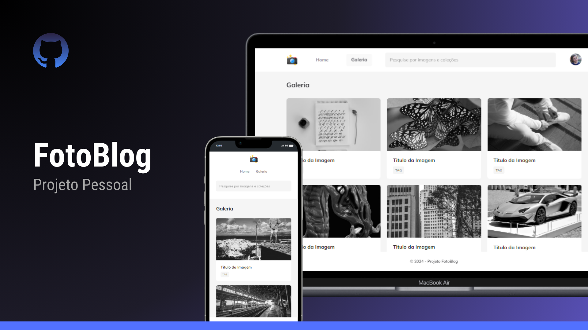

<h1 align="center"> FotoBlog </h1>

  <a href="#-tecnologias">Tecnologias</a>&nbsp;&nbsp;&nbsp;|&nbsp;&nbsp;&nbsp;
  <a href="#-projeto">Projeto</a>&nbsp;&nbsp;&nbsp;|&nbsp;&nbsp;&nbsp;
  <a href="#-layout">Layout</a>&nbsp;&nbsp;&nbsp;|&nbsp;&nbsp;&nbsp;
  <a href="#memo-licença">Licença</a>
  

  

 

  

## 🚀 Tecnologias

Esse projeto foi desenvolvido com as seguintes tecnologias:

- HTML e CSS
- Git e Github
- Figma

## 💻 Projeto

O projeto "FotoBlog" é um site para a exposição de imagens, contendo diversas animações e efeitos incríveis. Acesse o projeto para conferir:

- [Acesse o projeto finalizado (online). ](https://silverioesantos.github.io/FotoBlog/)

## 🔖 Layout

Você pode visualizar o layout base do projeto através [DESSE LINK](https://www.figma.com/file/LcbBugqcf9HOkIgtz310Nt/Fotoblog?type=design&t=kPGxWn8WdOjgAuUC-6). É necessário ter conta no [Figma](https://figma.com) para acessá-lo.

## :memo: Licença

Esse projeto está sob a licença MIT.
